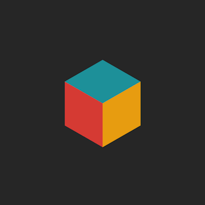

  
  
 _— BUT WHAT IF WE REALIZED —   THE BEAUTY LIES IN THE SPACES BETWEEN_

<h1>
   
  Hey I'm <strong>Chris</strong>
</h1>

  

### 
 Full-Stack Software Engineer | AI Explorer
 

Building polished, high performance applications with innovation and attention to detail. I like systems that feel impactful, interfaces that feel intentional, and code that feels clean. Always eager to improve and learn something new — currently exploring AI agents.

_Coding, to me, is both logical structure and visual rhythm — part engineering, part art._

### 👇 Random Things About Me
<ul>
  <li>💻 Currently delivering end-to-end products as a freelancer</li>
  <li>🧠 Exploring AI for better DX & UX</li>
  <li>🎨 Sometimes I doodle my thoughts into abstract patterns</li>
  <li>🧑‍🎨 My favorite artist is M.C. Escher (especially his visual impossibilities)</li>
  <li>🧩 I enjoy problem-solving with structure, symmetry & a bit of curiosity</li>
  <li>🏂 Learning to snowboard (and it's awesome)</li>
  <li>💪 Big calisthenics fan — keeping the brain sharp</li>
  <li>🤯 Occasionally: “many thoughts, one brain” energy — but I ship anyway</li>
</ul>

## 💻 Tech Skills

## 🌍 Let's Connect

